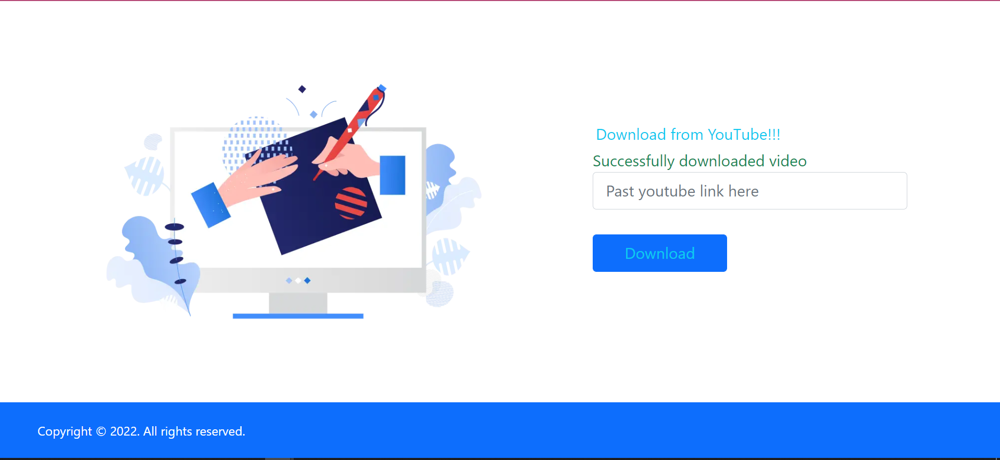

# Download YouTube videos Implementation using FastAPI
* Download YouTube videos of interest at the commandline.
* Access deployed app [here](https://youtome.onrender.com/)
* Deployed on render available [here](http://render.com/)
* Download path \Users\username\Downloads

Project Structure

-app

  -backend

    --home.py

  -core

    --config.py

  -static

    --style.css

    --favicon.ico

  -templates

    --home.html

  -main.py

## To host in render you need the following files
* deployment branch main

* Build command: pip install -r requirements.txt

* Start Command: uvicorn app.main:app --port=${PORT:-5000}

* Auto deploy: yes

* requirements.txt - This will have the packages your app will require to run  

## How the Page looks like
